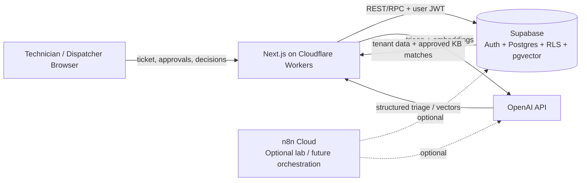
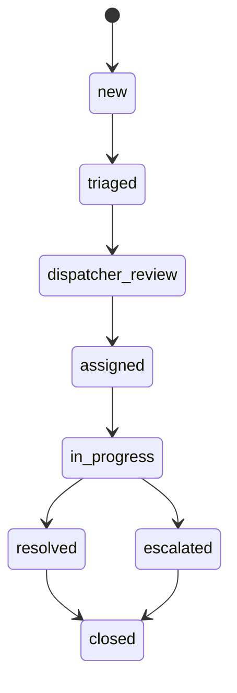

# System Architecture

## 1. System context

The live V1 is a cloud application that assists MSP dispatchers and technicians while keeping humans in control.

## 2. Runtime components

### Browser UI
The user can:

- submit a ticket
- review AI triage
- approve routing
- retrieve approved guidance
- resolve or escalate
- inspect audit history when authorized

### Next.js application
The Cloudflare-hosted application owns the live request flow:

- session handling
- API routes
- server-side OpenAI calls
- Supabase REST/RPC calls
- human approval actions
- response rendering

### Supabase
Supabase provides:

- Auth
- PostgreSQL
- Row Level Security
- pgvector storage
- tenant-scoped records
- approved-only retrieval
- audit persistence

### OpenAI
The live V1 uses OpenAI for:

- structured ticket triage
- `text-embedding-3-small` embeddings

Grounded troubleshooting text is constructed from retrieved approved knowledge, rather than allowing the system to invent unsupported steps.

### n8n
n8n was used as an integration/learning lab for embedding and semantic-search workflows. It is **not required in the current live critical path**.

## 3. Core data domains

The schema contains 11 principal tables:

- `organizations`
- `users`
- `tickets`
- `ticket_events`
- `ai_triage_runs`
- `knowledge_documents`
- `knowledge_chunks`
- `ai_recommendations`
- `human_decisions`
- `audit_logs`
- `evaluations`

An approved-knowledge view exposes only eligible knowledge chunks.

## 4. Ticket state model

## 5. Roles

- **Customer / requester** — creates the support request
- **Dispatcher** — reviews and approves routing
- **Technician** — reviews grounded guidance and decides what to do
- **Service Manager** — oversight, audit visibility, KB reindex operations
- **AI** — assists; it does not become the final authority

## 6. Architectural principles

1. Human approval before consequential service-desk decisions.
2. Tenant isolation through Supabase Auth + RLS.
3. Retrieval from approved knowledge only.
4. Explicit safe abstention when evidence is weak.
5. Auditability of major actions.
6. Keep the V1 architecture simple until a real MSP pilot creates a concrete integration requirement.
