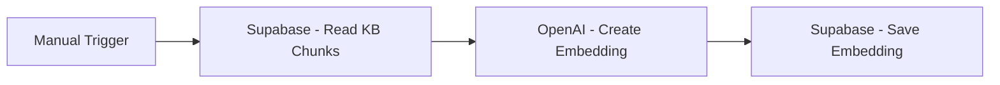
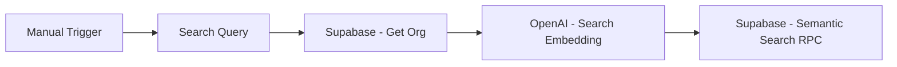

# n8n Workflow Lab

## Current role of n8n

n8n is **not in the live V1 critical request path**.

The production flow is:

Browser → Cloudflare-hosted Next.js application → Supabase / OpenAI.

n8n remains useful for external orchestration, integrations, notifications, data synchronization, scheduled jobs, and future MSP-specific automation.

## Workflow 1 — Knowledge Embedding Pipeline

Development/lab flow:

Purpose:

1. Read knowledge chunks.
2. Send each chunk's `chunk_text` to the OpenAI embeddings endpoint.
3. Store the resulting 1536-dimensional vector against the correct chunk.

Critical lesson: verify that each chunk receives its own distinct embedding.

## Workflow 2 — Semantic Search Test

Purpose:

- create a query embedding
- call the approved-knowledge vector-search RPC
- inspect similarity ranking
- validate threshold behavior

## Debugging lessons

### Field typing
When n8n “Using Fields Below” treated `1536` as a string, OpenAI rejected the `dimensions` parameter. Omitting the optional field allowed the model's default 1536 dimensions.

### Item mapping
Workflow success does not guarantee correct per-item mapping. Always compare multiple output vectors and verify database values.

### Secrets
API keys belong in n8n credentials or a secure secret store. Never put them in exported public workflow JSON or documentation.

## Future production uses

Add n8n only when the pilot requires a real integration, for example:

- ConnectWise / Autotask / HaloPSA webhooks
- notification workflows
- ticket synchronization
- scheduled KB ingestion
- escalation notifications
- reporting or evaluation jobs
