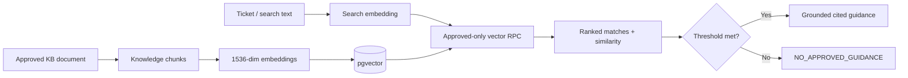

# Data, Retrieval & Security

## Tenant isolation

Users authenticate with Supabase Auth. The application maps `auth.uid()` to a row in `public.users`, which supplies the user's organization and role.

Row Level Security enforces organization-level isolation.

## Approved-knowledge retrieval

The retrieval pipeline is:

## Vector configuration

- embedding model: `text-embedding-3-small`
- vector dimension: 1536
- knowledge embeddings stored in `knowledge_chunks.embedding`
- approved knowledge is filtered before it becomes guidance
- similarity threshold is configurable

During acceptance testing, 4 demo chunks were reindexed and verified to contain 4 distinct vectors.

## Secret management

Secret values must remain outside Git.

Runtime configuration includes names such as:

- `SUPABASE_URL`
- `SUPABASE_ANON_KEY`
- `OPENAI_API_KEY`
- `OPENAI_MODEL`
- `OPENAI_EMBEDDING_MODEL`
- `RAG_MIN_SIMILARITY`

Cloudflare stores runtime secrets; local testing uses uncommitted environment files.

## Trust controls

### Human in the loop
The AI supports the dispatcher and technician. It does not replace the final human decision.

### Safe abstention
Weak or irrelevant evidence results in exact `NO_APPROVED_GUIDANCE`.

### No credential access
The V1 is not designed to retrieve or operate with customer passwords, VPN credentials, firewall credentials, or other privileged configuration secrets.

### Auditability
Ticket creation, routing, recommendations, decisions, and major transitions are persisted for review.

## Public disclosure rules

Public documentation may describe architecture, workflows, table names, safety mechanisms, models, and acceptance behavior. It must not expose:

- secret values
- private customer data
- private credentials
- proprietary customer KB content
- confidential MSP identifiers
