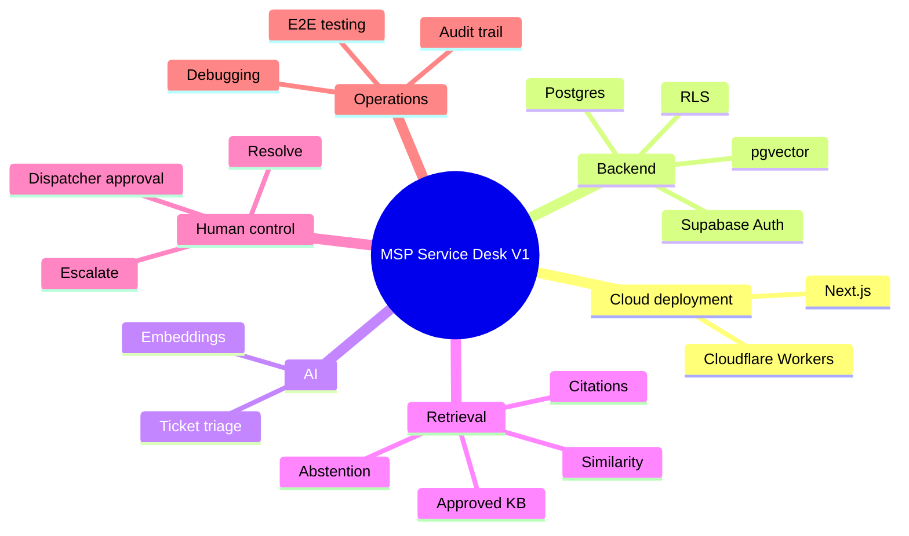

# Hands-On Technical Learning Map

This project provides practical exposure across application development, databases, AI integration, retrieval, security, automation, debugging, and deployment.

## 1. Cloud application deployment

Hands-on topics:

- Next.js App Router
- TypeScript
- server API routes
- environment configuration
- OpenNext
- Cloudflare Workers
- live deployment verification

## 2. Supabase backend

Hands-on topics:

- PostgreSQL schema design
- SQL migrations
- foreign keys and constraints
- Supabase Auth
- Row Level Security
- REST endpoints
- RPC functions
- pgvector
- tenant-scoped data

## 3. OpenAI integration

Hands-on topics:

- embeddings API
- JSON request mapping
- structured triage
- API authentication
- model parameter debugging
- embedding dimension/type validation

## 4. Semantic retrieval / RAG foundations

You can now explain:

- document → chunk → embedding → vector storage
- search text → search embedding
- cosine-distance similarity ranking
- metadata / approval filtering
- similarity thresholds
- citations
- abstention when evidence is insufficient

## 5. n8n workflow lab

You worked with:

- HTTP Request nodes
- Supabase REST calls
- OpenAI embedding requests
- item-by-item mapping
- expressions such as `$json.chunk_text`
- PATCH operations
- semantic-search RPC testing

The important architectural lesson: a tool is used when it improves the solution; it does not need to sit in the critical path simply because it was used during development.

## 6. Security engineering

Hands-on topics:

- authentication vs authorization
- tenant isolation
- least privilege
- RLS
- service-side RPC
- secrets management
- human approval gates
- audit records

## 7. Debugging lessons from the real build

### Correct host / project identity
Small URL/project-reference mistakes can make a correct workflow look broken. Verify the endpoint before debugging application logic.

### API field types matter
The OpenAI `dimensions` field required an integer; sending `"1536"` as text failed.

### Per-item workflow mapping matters
A pipeline can receive four different source items yet accidentally persist the same mapped output. Always verify item identity and output identity.

### Do not trust “success” without data verification
The embedding workflow had completed successfully, but SQL inspection revealed identical stored vectors. Verification discovered the real problem.

### Build environments matter
The application build worked, but OpenNext on Windows encountered dependency/file-lock problems. A clean build directory resolved the deployment blocker.

## 8. What you should now be able to explain

## Next learning phase

Do not expand the stack without a customer-driven reason. The highest-value next technical learning should come from a real MSP pilot: PSA/helpdesk integration, real KB onboarding, monitoring, evaluation, and production hardening.
