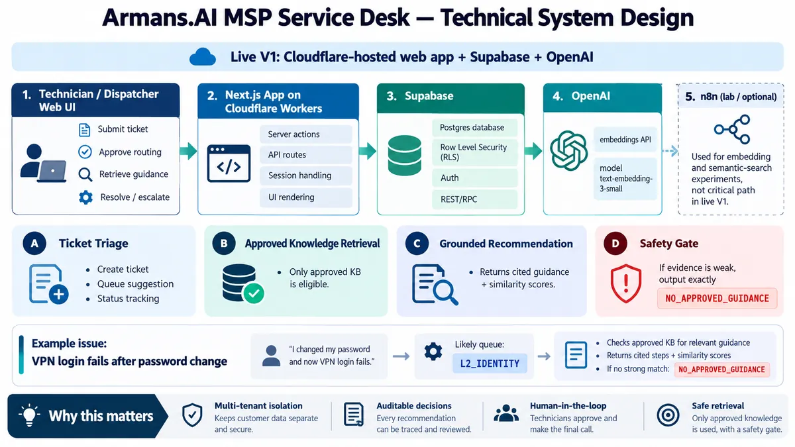
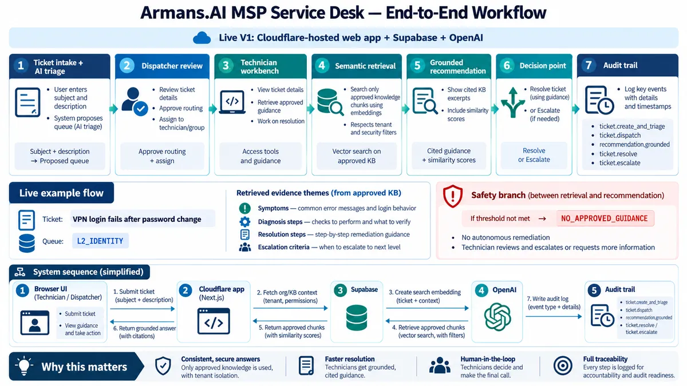
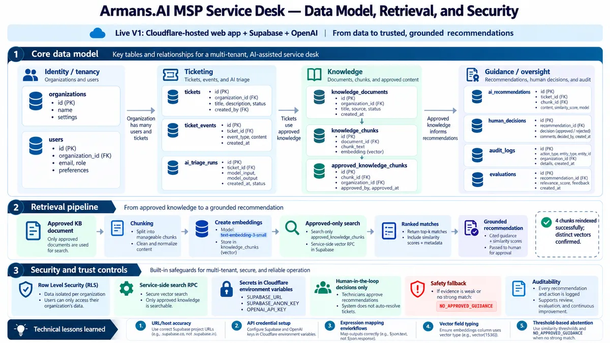
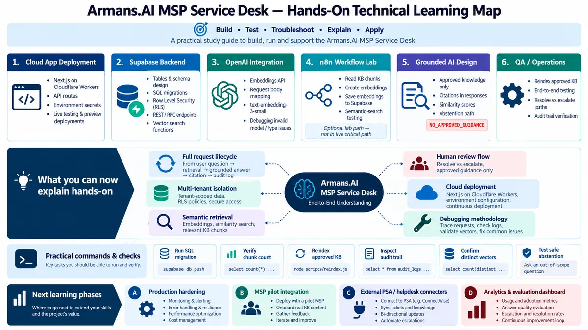
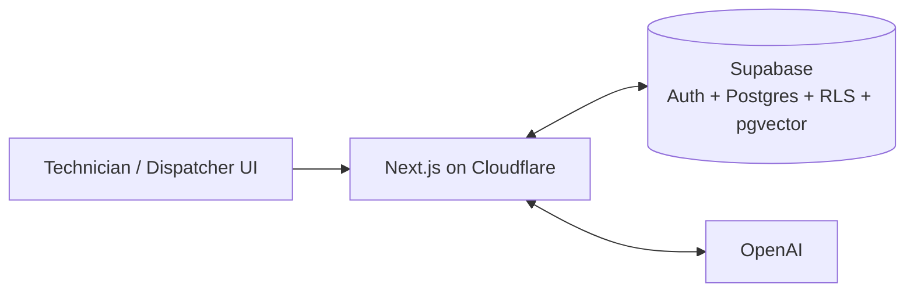
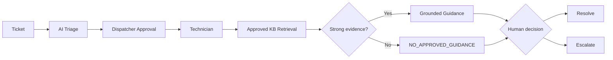

# Visual Learning Materials

This repository includes a public-safe visual learning set for understanding the V1 architecture, workflow, data model, security controls, and practical technical skills.

## 1. Technical system design

Shows the live V1 path:

Technician / Dispatcher UI → Next.js on Cloudflare Workers → Supabase → OpenAI.

It also shows that n8n is currently an optional lab/orchestration tool rather than part of the live request critical path.

## 2. End-to-end workflow

Covers:

- ticket intake and AI triage
- dispatcher review
- technician workbench
- approved-only semantic retrieval
- grounded recommendation
- resolve / escalate decision
- audit trail
- safe abstention with `NO_APPROVED_GUIDANCE`

## 3. Data model, retrieval, and security

Covers:

- identity / tenancy
- ticketing tables
- knowledge documents and chunks
- AI recommendations and human decisions
- pgvector retrieval
- RLS
- service-side search RPC
- Cloudflare secret management
- auditability and human control

## 4. Hands-on technical learning map

Summarizes the practical exposure gained through this project:

- Cloudflare deployment
- Supabase backend
- OpenAI integration
- n8n workflow lab
- grounded AI / RAG design
- QA and operations
- debugging methodology
- production-hardening next steps

## Architecture at a glance

## Human-controlled service workflow

## Public-safe scope

These visuals intentionally explain architecture and workflow without exposing API keys, passwords, customer credentials, private MSP data, or confidential knowledge-base content.
