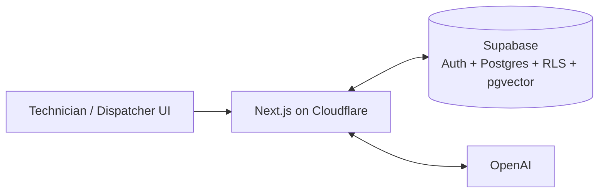
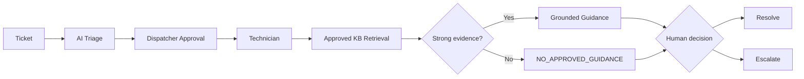

# Visual Learning Materials

This repository's documentation is designed to be understandable visually as well as through code.

## Architecture at a glance

## Human-controlled service workflow

## Generated infographic set

The project has four generated training visuals intended for `docs/images/`:

1. `system-design.webp` — technical system design
2. `end-to-end-workflow.webp` — full operational workflow
3. `data-model-retrieval-security.webp` — data model, retrieval, and security
4. `technical-learning-map.webp` — hands-on learning map

Once the binary image assets are present in `docs/images/`, they can be embedded directly in this page and the root README.
