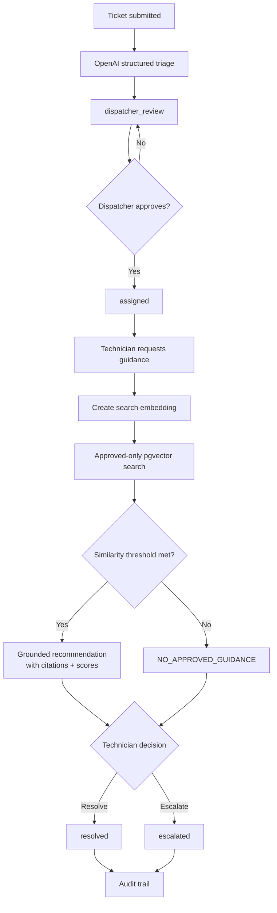

# End-to-End Workflow

## Primary live workflow



## Happy-path example

**Ticket:** VPN login fails after password change.

1. Ticket subject and description are submitted.
2. AI triage extracts structure and proposes a queue.
3. The tested example routed to `L2_IDENTITY`.
4. Dispatcher explicitly approves routing and assignment.
5. Technician requests guidance.
6. The system embeds the ticket/search text.
7. Supabase searches only approved knowledge chunks.
8. Ranked matches include similarity scores and source locators.
9. The UI displays a grounded recommendation.
10. Technician resolves the ticket.
11. Audit entries record the major events.

## Safety-path example

**Ticket:** Laptop battery swollen and not charging.

The only approved demo knowledge was VPN-related. The retrieval threshold was not met, so the system returned exactly:

```text
NO_APPROVED_GUIDANCE
```

The technician then escalated the ticket. This proves the system does not force irrelevant KB content into an answer.

## Human-control points

- dispatcher approves routing
- technician requests guidance
- technician decides resolve vs escalate
- service manager controls approved KB reindexing

## Key audit events observed

- `ticket.create_and_triage`
- `ticket.dispatch`
- `recommendation.grounded`
- `ticket.resolve`
- `ticket.escalate`

## What is intentionally absent

- autonomous remediation
- credential access
- firewall/device changes
- automatic ticket closure without human decision
- unapproved knowledge as troubleshooting evidence
